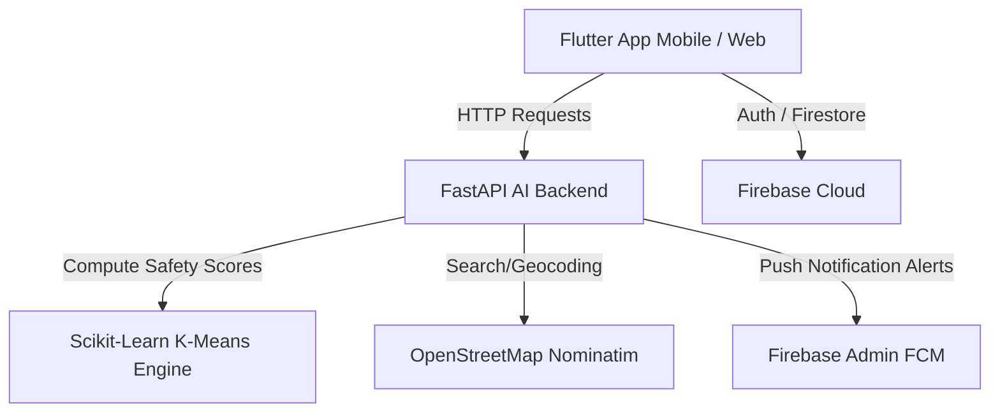

# GoSafer: A Smart Women Safety Application

[](https://flutter.dev)
[](https://fastapi.tiangolo.com)
[](https://scikit-learn.org)
[](https://firebase.google.com)

GoSafer is an advanced, cross-platform safety application designed to empower women by combining **AI-driven safety routing**, **real-time crime data visualization**, and an **instant peer-to-peer emergency response system**.

---

## 🚀 Key Features

*   **🛡️ AI-Driven Safe Routing:** Evaluate route alternatives before you travel. The application analyzes routes using a local safety index and alerts users to avoid high-risk or poorly-lit zones, especially during night hours.
*   **📍 Real-Time Crime Heatmap:** Interactive maps showing local crime hotspots (compiled using K-Means clustering algorithm on a Pune crime dataset).
*   **🚨 Multi-Peer SOS Emergency Alerts:** Instantly trigger an SOS signal. Nearby registered app users receive push notifications with live coordinates of the victim so they can coordinate emergency assistance.
*   **🗺️ OpenStreetMap Integration:** Zero-cost address lookup and geocoding powered by OpenStreetMap's Nominatim API.
*   **🔐 Secure Authentication:** Seamless user onboarding, profile creation, and safety credential storage utilizing Firebase Authentication and Firestore.

---

## 🛠️ Architecture & Tech Stack

GoSafer is divided into two principal components: a cross-platform client app and an intelligent microservice backend.



### Frontend (Client)
*   **Framework:** [Flutter](https://flutter.dev) (Dart)
*   **State Management:** ChangeNotifier / Provider
*   **Mapping:** Flutter Map (Leaflet-based) & OpenStreetMap
*   **Database Sync:** Firebase SDK (Firestore, FirebaseAuth)

### Backend (Server)
*   **Framework:** [FastAPI](https://fastapi.tiangolo.com) (Python)
*   **AI/ML Engines:** Scikit-Learn (K-Means Clustering), Pandas, NumPy
*   **Services:** Firebase Admin SDK (Cloud Messaging & Firestore)
*   **Routing Engine:** OSRM (Open Source Routing Machine)

---

## 📂 Project Structure

```text
gosafer/
├── android/            # Native Android runner configurations
├── ios/                # Native iOS runner configurations
├── web/                # Web entry files (index.html, manifest.json)
├── assets/
│   └── data/           # CSV crime datasets used by the AI engine
├── backend/            # FastAPI Python server
│   ├── main.py         # Entry API gateway and server controllers
│   ├── crime_engine.py # ML K-Means clustering implementation
│   ├── safety_router.py# Polyline risk evaluation algorithms
│   └── requirements.txt# Python dependency list
├── lib/                # Flutter source code
│   ├── components/     # UI modules (Ride Planner, Route Info cards)
│   ├── constants/      # App colors, local API endpoints configuration
│   ├── models/         # User and data object structures
│   ├── providers/      # Application theme and state management
│   ├── screens/        # UI Views (Map, Authentication, SOS)
│   └── services/       # Network, API, SOS & Firebase client wrappers
└── test/               # Flutter unit and widget tests
```

---

## ⚙️ Getting Started

### Prerequisites
*   [Flutter SDK](https://docs.flutter.dev/get-started/install) (v3.22 or newer)
*   [Python 3.10+](https://www.python.org/downloads/)
*   A [Firebase Project](https://console.firebase.google.com/) configured for Flutter

---

### Setup Instructions

#### 1. Backend Server Setup
Navigate to the `backend/` directory, set up a virtual environment, and install dependencies:

```bash
cd backend
python -m venv venv
source venv/Scripts/activate     # For Windows Power Shell/CMD: .\venv\Scripts\activate
pip install -r requirements.txt
```

Create a `.env` file inside the `backend/` directory:
```env
GOOGLE_MAPS_API_KEY=YOUR_GOOGLE_MAPS_API_KEY
FIREBASE_SERVICE_ACCOUNT_PATH=service-account-key.json
```

Place your Firebase private service account key credentials in `backend/service-account-key.json` (you can generate this in the Firebase Console under **Project Settings > Service Accounts**).

Start the backend server locally:
```bash
uvicorn main:app --reload --host 0.0.0.0 --port 8000  //just run python main.py
```

#### 2. Flutter Client Setup
Open a new terminal at the root of the project:

```bash
# Retrieve Flutter package dependencies
flutter pub get
```

Set up your Firebase configuration:
1. Configure Firebase in your project using `flutterfire configure`.
2. Add your Google Maps API Key to:
   - [AndroidManifest.xml](file:///e:/mini/GoSafer/gosafer/android/app/src/main/AndroidManifest.xml) in the `<meta-data>` geo tag.
   - [index.html](file:///e:/mini/GoSafer/gosafer/web/index.html) in the Google Maps JS script src.

Configure API endpoints in [api_constants.dart](file:///e:/mini/GoSafer/gosafer/lib/constants/api_constants.dart):
* Replace the `physicalDeviceIp` constant with your machine's local IPv4 address (e.g. `192.168.1.XX`) so your physical testing device can reach the FastAPI backend server on your computer.

Launch the application:
```bash
flutter run
```

---

## 🔌 API Endpoints (FastAPI)

Below are the key backend endpoints exposed by the Python server:

*   **`GET /health`** - Check the server and AI Engine cluster readiness.
*   **`GET /crime/centroids`** - Retrieves clustered centroids generated by the K-Means algorithm representing crime areas and their risk ratings.
*   **`GET /crime/heatmap`** - Returns latitude, longitude, and volume coordinates of occurrences for mapping rendering.
*   **`POST /route/evaluate`** - Evaluates risk scores along a GPS coordinate polyline.
*   **`POST /sos/trigger`** - Broadcasts SOS signals to active users in proximity via FCM.

---

## 🔒 Security Best Practices

To maintain data safety and security:
* **Keys and Configs:** Do not upload your Firebase `service-account-key.json`, `.env`, or any other secret configuration files. They are excluded by `.gitignore`.
* **Google Services File:** Keep `google-services.json` (Android Firebase config) out of version control. Place it in `android/app/` and ensure it is listed in `.gitignore`. The iOS counterpart (`GoogleService-Info.plist`) should also be ignored.
* **Keystores:** Android release keys (`key.properties`, keystores) are ignored.
* **API Restriction:** If using public APIs (such as Google Maps API keys), restrict them on the Google Cloud Console to only accept calls from your application package name.
